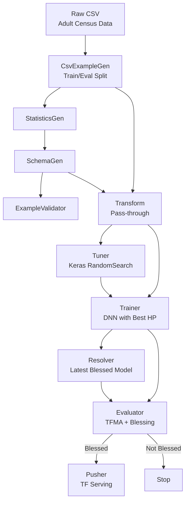

# Adult Income TFX Pipeline


An end-to-end machine learning pipeline for adult income classification using TensorFlow Extended (TFX). This project predicts whether a person's income exceeds $50K/year based on UCI Census Income data — covering data validation, preprocessing, hyperparameter tuning, model training, evaluation, and deployment with TensorFlow Serving.

---

## Table of Contents
- [Overview](#overview)
- [Tech Stack](#tech-stack)
- [Project Structure](#project-structure)
- [Dataset](#dataset)
- [Getting Started](#getting-started)
- [Pipeline Diagram](#pipeline-diagram)
- [Experiment Results](#experiment-results)
- [Author](#author)

---

## Overview

This project builds a complete ML pipeline to predict whether an individual earns **>50K or <=50K per year** based on demographic and employment features.

**Pipeline stages:**
1. **Data Ingestion** — CSV loading with `CsvExampleGen`
2. **Data Validation** — Statistics generation, schema inference, anomaly detection
3. **Transform** — Feature preprocessing via TensorFlow Transform
4. **Hyperparameter Tuning** — Keras Tuner RandomSearch (5 trials)
5. **Training** — Deep Neural Network with best tuning parameters
6. **Evaluation** — TFMA with blessing threshold (accuracy ≥ 0.80)
7. **Deployment** — Push to TensorFlow Serving

---

## Tech Stack

| Category | Tools |
|---|---|
| Language | Python 3.9 |
| ML Pipeline | TensorFlow Extended (TFX) 1.11.0 |
| Deep Learning | TensorFlow 2.10, Keras |
| Hyperparameter Tuning | Keras Tuner |
| Model Evaluation | TensorFlow Model Analysis (TFMA) |
| Serving | TensorFlow Serving (Docker) |
| Data Source | UCI ML Repository |

---

## Project Structure

```
adult-income-tfx-pipeline/
├── README.md
├── requirements.txt
├── setup.sh                          # Environment setup script
├── notebook.ipynb                    # Main pipeline notebook (executed)
├── adult-income-testing.ipynb        # Prediction testing notebook
├── transform_module.py               # TFX Transform preprocessing module
├── trainer_module.py                 # TFX Trainer module (model definition + training)
├── tuner_module.py                   # TFX Tuner module (hyperparameter search)
├── adult-income-pipeline/            # TFX pipeline artifacts
│   ├── CsvExampleGen/
│   ├── StatisticsGen/
│   ├── SchemaGen/
│   ├── ExampleValidator/
│   ├── Transform/
│   ├── Tuner/
│   ├── Trainer/
│   ├── Evaluator/
│   ├── Pusher/
│   └── metadata.sqlite
└── serving_model/                    # Pushed SavedModel for serving
    └── adult_income_model/
```

---

## Dataset

- **Source**: [UCI ML Repository - Adult/Census Income](https://archive.ics.uci.edu/dataset/2/adult)
- **Size**: 48,842 rows → 45,222 after cleaning
- **Task**: Binary Classification (>50K or <=50K)
- **Features**: 6 numerical + 8 categorical (age, workclass, education, occupation, etc.)
- **Class Balance**: 75% <=50K, 25% >50K

---

## Getting Started

### Prerequisites
- Linux / WSL2 (recommended)
- Docker (for TF Serving)

### 1. Clone Repository
```bash
git clone https://github.com/sintiasnn/adult-income-tfx-pipeline.git
cd adult-income-tfx-pipeline
```

### 2. Setup Environment

TFX requires Python 3.9 and is best managed via Conda. Run the setup script — it auto-installs Miniconda if needed:

```bash
bash setup.sh
```

Or manually:

```bash
# Install Miniconda (if not installed)
wget https://repo.anaconda.com/miniconda/Miniconda3-py39_24.7.1-0-Linux-x86_64.sh -O miniconda.sh
bash miniconda.sh -b -p $HOME/miniconda
source $HOME/miniconda/bin/activate

# Create environment
conda create -n adult-income-tfx python==3.9.15 -y
conda activate adult-income-tfx
pip install jupyter scikit-learn tensorflow tfx==1.11.0 flask joblib keras-tuner
```

### 3. Run Pipeline
Open and execute all cells in `notebook.ipynb`:
```bash
jupyter notebook notebook.ipynb
```

This runs the full TFX pipeline:
- Downloads and preprocesses the Adult dataset (z-score normalization + label encoding)
- Validates data with StatisticsGen, SchemaGen, and ExampleValidator
- Transforms features via TensorFlow Transform
- Tunes hyperparameters with Keras Tuner (5 trials)
- Trains a DNN model using optimal hyperparameters
- Evaluates with TFMA (threshold: accuracy ≥ 0.80)
- Pushes blessed model to `serving_model/`

### 4. Serve Model with TensorFlow Serving
```bash
docker run -p 8501:8501 \
  --mount type=bind,source=$(pwd)/serving_model/adult_income_model,target=/models/adult_income \
  -e MODEL_NAME=adult_income \
  -t tensorflow/serving
```

### 5. Test Predictions
Open and run `adult-income-testing.ipynb` to send prediction requests to the running model server.

---

## Pipeline Diagram



---

## Experiment Results

| Metric | Value |
|---|---|
| Binary Accuracy | **0.8540** |
| AUC-ROC | **0.9060** |
| Binary Crossentropy | 0.3112 |

**Best Hyperparameters (Tuner):**
- `units_1`: 256
- `units_2`: 64
- `dropout_rate`: 0.2
- `learning_rate`: 0.001

---

## Author

**Ni Putu Sintia Wati**
- GitHub: [@sintiasnn](https://github.com/sintiasnn)

---

## License

This project is open source and available under the [MIT License](LICENSE).
